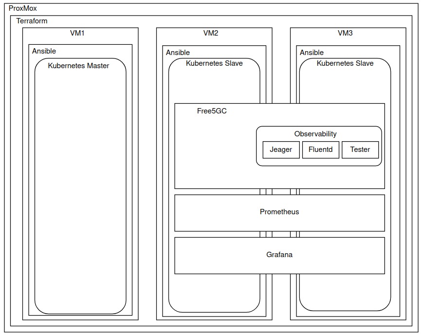
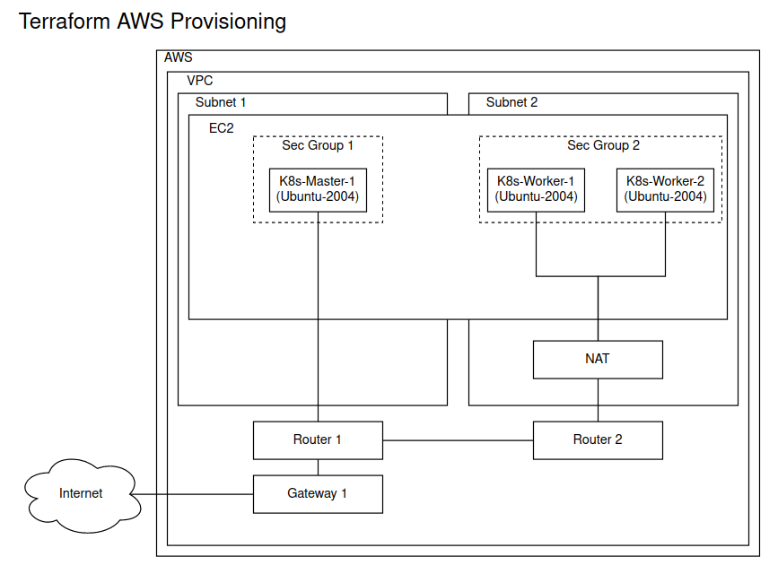
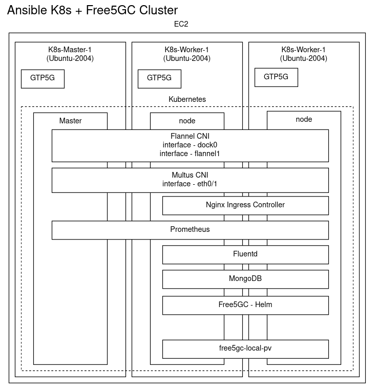
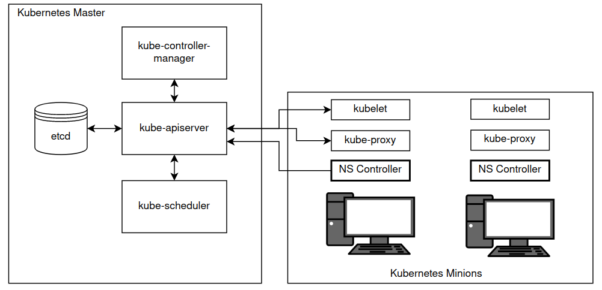
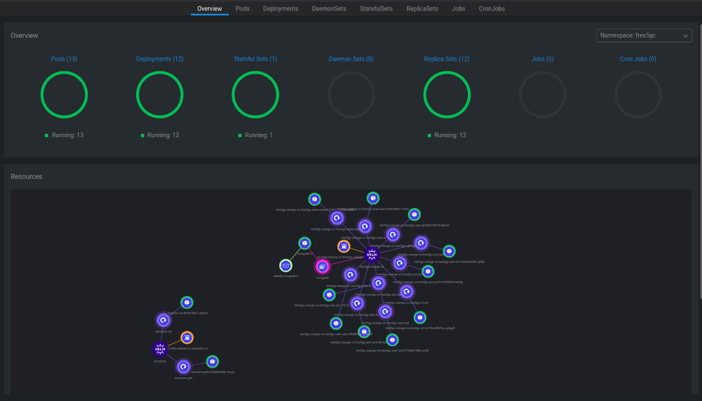
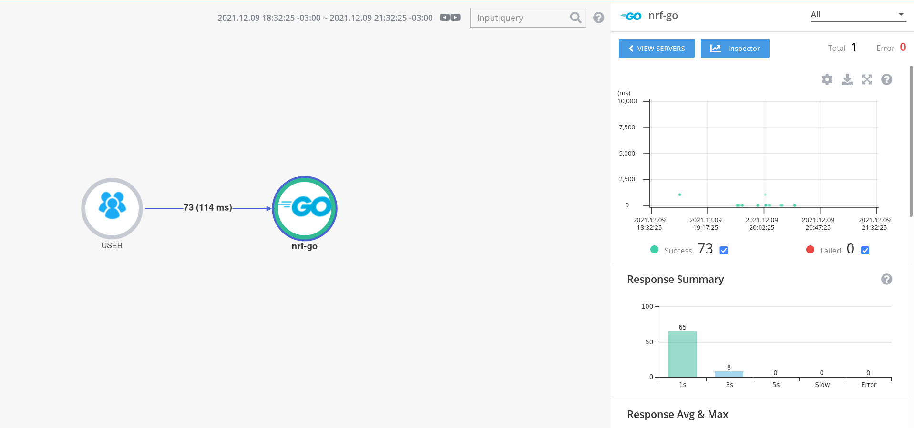
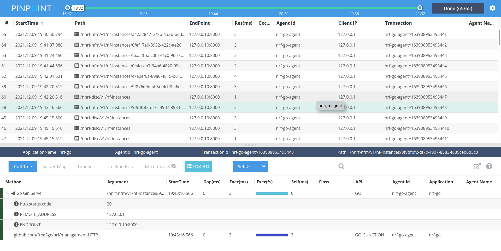

# 5G Core Network Slicing

## Requirements

AWS Account **or** ProxMox Hypervisor

For one-step deploy Linux is required

## Description

This project is a easy to use infrastructure and monitoring implementation of the free5GC project. Running on AWS or Proxmox environment using Terraform and Ansible as IaC. This project focus on observability to visualize core communication and easy implement Network Slicing

## Architecture

High Level architecture is based in Proxmox Hypervisor (AWS compatible) using 4 virtual machines, 3 Kuberentes Worker and 1 Kubernetes Master. The projetct uses observability principles described on "Production-Ready Microsservices", by  O"Reilly. The project load metrics from hosts using Prometheus and send to grafana. The applications send tracing logs, and metrics via PinPoint Goland Agent to PinPoint APM. Jaeger was tested but the technology is not matture to easy-to-use on this project.




The AWS architecture was designed to provide the entire AWS VPC and security resources. Terraform with AWS provider build the entire infrastructure that corresponds to:

* 1x Global VPC;
* 2x Subnets (Public and Private)
* 2 Routers (Public and Private)
* 1 Gateway to expose public Router to internet
* 1 NAT to private Subnet
* 2 Security Groups with same configuration to implements in the future port restrictions.




Kubernetes cluster is configured by Ansible Playbook. Follow free5GC Helm especifications.

* GTP5G Kernel Module
* Helm 3+
* Simple CNI (Flannel)
* Multus CNI
* Free5GC Namespace
* free5gc-local-pv
* MongoDB

After the entire Free5GC Helm especifications configuration the playbook add Prometheus, Nginx Ingress Controller, Fluend and run Helm Install.




## Installation and Getting Started

To run AWS configuration remember to add [AWS Credentials](https://docs.aws.amazon.com/sdk-for-javascript/v2/developer-guide/getting-your-credentials.html)

To install run the commands:

```bash
git clone https://github.com/fhgrings/5g-core-network-slicing.git
cd 5g-core-network-slicing.git/infra/aws-tform-e2e
./run.sh
```

After Installed enter on [AWS Console](https://us-east-2.console.aws.amazon.com/console/home) and connect to K8S-DEMO-EC2-MASTER-pub;

Run the commands:

```bash
export KUBECONFIG=/etc/kubernetes/adming.config
kubectl get pods -A
```


For a better cluster overview I recommend to install Lens IDE and connect to Kubernetes Cluster:




### Monitoring

- [x] **PinPoint**
- [x] **Elastic APM**
- [x] ~~NewRelic~~ (Not Working - Go Agent needs Go 1.17+)
- [x] ~~OpenTelemtry~~ (No Agent for gin/gonic)
- [x] ~~Datadog~~ (No Agent for gin/gonic)

#### Why did not work?

Observability is based on instrumentation, hard coded or agents that implement by their own. It's necessary to change the HTTP call methods to log the inputs and outputs with monitoring headers. 

Go does not natively accept sidecars to change compiled code, so changes need to be made inside the code. 

Gin/gonic is not a widely used framework, so not all APM tools provide agents to monitor the requests

To monitor a request you need to create a tracer between Request and Response, but the project uses OpenAPI. All important requests are already mapped by Yaml files and are compiled when running the tool, blocking access to the methods that perform the requests, making it necessary to change compiled packages to add the monitoring tools (Not possible for this scope). 

As the scope of the project is limited to the slicing of the network and monitoring would be a plus to help understanding, it ends here the monitoring advances. 

It was possible to group all the requests made in the applications, but without tracking the senders, only the receivers.




a




Fonts:

https://opentelemetry.io/docs/instrumentation/go/getting-started/

https://github.com/pinpoint-apm/pinpoint-go-agent/tree/main/plugin/gin

https://pkg.go.dev/net/http

https://pkg.go.dev/golang.org/x/net/http2/h2c

https://github.com/free5gc/amf/blob/e857bcd091ec69e66a2d390345fb4faf5c5d89e2/consumer/nf_mangement.go (Exemplo de classe: Nnrf_NFManagement)


## Fonts

https://github.com/pinpoint-apm/pinpoint-go-agent/tree/main/plugin/gin

https://pkg.go.dev/net/http

https://pkg.go.dev/golang.org/x/net/http2/h2c

https://docs.aws.amazon.com/

https://www.free5gc.org/

https://github.com/ciromacedo/5GCore-easy-install

https://github.com/Orange-OpenSource/towards5gs-helm
