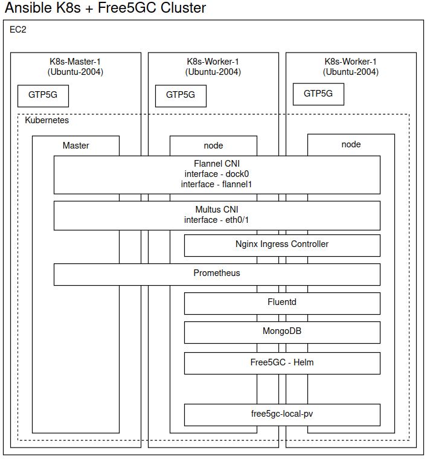

# 5G Core Network Slicing

## Requirements

AWS Account **or** ProxMox Hypervisor

For one-step deploy Linux is required

## Description

This project is a easy to use infrastructure and monitoring implementation of the free5GC project. Running on AWS or Proxmox environment using Terraform and Ansible as IaC. This project focus on observability to visualize core communication and easy implement Network Slicing

## Architecture

Primeira arquitetura desenhada para solução do problema foi utilizando Proxmox e os principios de observabilidade do livro "Microsserviços prontos para produção" de XXX. A arquitetura se baseavaem 4 Maquinas virtuais carregadas com um cluster Kubernetes, sendo 1 master e 3 workers.


A segunda arquitetura - para aumentar a testabilidade do projeto pela comunidade - foi pensada utilizando algum recurso/provisionador público, assim escolhido a AWS. Para o provisionamento das maquinas virtuais foram configurados os acessos de rede e segurança  necessários para o deploy do mesmo. 

Utilizando terraform foi levantada uma Virtual Private Cloud, divida em duas Subnets (publica e privada), onde foram distribuidos os masters e workers do cluster kubernetes. Cada subnet recebeu 1 grupo de segurança com as mesmas definições (deixando as possibilidade de bloqueio de portas desnecessárias, mapeadas após o levantamento da infraestrutura). Para comunicação foram levantados 2 Roteradores, sendo o publico conectado ao gateway de acesso a internet, e outro apenas conectado ao NAT para comunicação interna com a internet, sem expor as máquinas desse grupo.


O cluster Kubernetes é configurado por uma ansible playbook




## Installation and Getting Started

Para rodar o projeto certifiquesse que está com as credenciais AWS configuradas em sua máquina.

```bash
git clone ...
cd ...
./run.sh
```

Após a configuração rode

```bash
kubectl get pods -A
```


a


### Monitoring

PinPoint

Elastic APM

NewRelic

OpenTelemtry

Datadog

#### Why did not work?

O projeto free5gc utiliza a biblioteca OpenAPI para padronizar e buildar o projeto baseado em arquivos de configuração Yaml. Todas as requisições importantes já estão listadas nesses arquivos de configuração, assim sendo criadas por uma camada de isolamento da ferramenta OpenAPI, sendo impossibildade a alteração, já que todas as requisições agora são feitas por pacotes. Go é uma linguagem de programação relativamente recente e sua observabilidade ainda não se algo popular. Muitos problemas e muita complexidade ainda é existente para o monitoramento dessas aplicações. O projeto free5gc ainda utiliza o Framework gin gonic que diminui ainda mais as possbilidades de ferramentas de monitoramento dado que não é um framework muito popular.


a


## Conclusion

## Fonts

https://github.com/pinpoint-apm/pinpoint-go-agent/tree/main/plugin/gin

https://pkg.go.dev/net/http

https://pkg.go.dev/golang.org/x/net/http2/h2c
